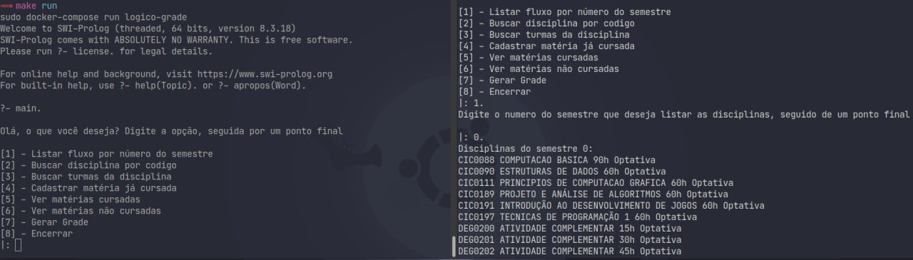

# Grade

Disciplina: FGA0210 - PARADIGMAS DE PROGRAMAÇÃO - T01
Nro do Grupo: 04
Paradigma: Lógico

## Alunos

Disponível em PDF [aqui](Grupo04.pdf).

| Matrícula | Aluno                              |
| --------- | ---------------------------------- |
| 170033066 | Esio Gustavo Pereira Freitas       |
| 170050939 | Lucas Dutra Ferreira do Nascimento |
| 170017885 | Marcos Nery Borges Júnior          |
| 170020461 | Pedro Henrique Andrade Féo         |
| 170024334 | Youssef Muhamad                    |

## Sobre

O programa é um sistema de recomendações de matérias. Ele permite que o usuário informe uma matéria que deseja cursar. Nisso o sistema vai averiguar de acordo com a materia tempo e requisitos se o usuário pode opu não cursar a respectiva matéria. Caso ele não possa, o sistema recomendará uma lista de matérias que o usuário possa se matricular.

## Screenshots



## Instalação

**Linguagens**: Prolog<br>
**Tecnologias**: SWI-Prolog<br>

### Via docker
Se você tiver [docker](https://docs.docker.com/get-docker/) e [docker-compose](https://docs.docker.com/compose/install/) instalados, basta rodar o comando a seguir na raiz do projeto e pronto:

```docker-compose run logico-grade```
ou 
```make run```
  
Para parar o container em andamento:
```docker-compose down```
ou 
```make down```

### Manualmente
Para instalar manualmente, você precisará do [swipl](https://www.swi-prolog.org/download/stable). Com ele instalado, basta executar  
```swipl main.pl``` na raiz do projeto.


## Uso
O primeiro passo é executar ```main.``` , uma vez ja dentro do swipl (seja via docker ou manualmente). Isso te dará um menu de opções.
Menu de opções:

1. listar matrerias
2. pesquisar materia
3. verificar materia
4. recomendação de materia

## Vídeo

Vídeo disponível [aqui](https://youtu.be/8ghh6wGt0mQ).

## Outros

Para abastecer nossa base de dados, copiamos o conteúdo do SIGAA em arquivos .txt e utilizamos algumas expressões regulares para transformar o texto para um formato que seria de mais fácil uso. Seguem alguns exemplos:

De:
```
([0-9A-Z]+)\s2020.2\s([A-Z\s]+)\s\(([0-9]+h)\)\s([0-9A-Z\s]+)\s\n+([0-9]+)\s([0-9]+)\s(a designar|FGA)

A	2020.2	LUIS FERNANDO BALDUINO DE SOUSA (30h)	24T23 

45	43	a designar
```

Para:
```
';$1;$2;$3;$4'.

';A;LUIS FERNANDO BALDUINO DE SOUSA;30h;24T23'.
```

De:
```
([A-Z]{3}[0-9]{4}) - ([a-záàâãéèêíïóôõöúçñ 0-9,-]+)- ([0-9]+h)\s([a-záàâãéèêíïóôõöúçñ]+)

FGA0161 - ENGENHARIA E AMBIENTE - 60h	Obrigatória	
```

Para:
```
'$1;$2;$3;$4'.

'FGA0161;ENGENHARIA E AMBIENTE;60h;Obrigatória'.
```

## Fontes

- swi-prolog: https://www.swi-prolog.org/
